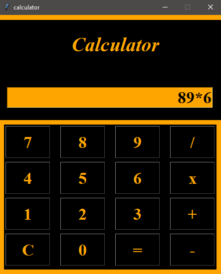

# Calculator_with_GUI👩‍💻 

## Code Requirements
- Tkinter (Available in python)

## Project Commands
- It is a calculator which performs basic functions such as:
  - Addition (+)
  - Subtraction (-)
  - Multiplication (*)
  - Division (/)
  - Clear (C)
  - Equals (=)
 
 ### --> Basic UI(User Interface) :

